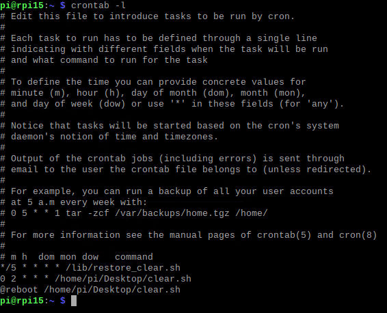

# Ex001 Clear Raspberry Pi

This exercise implements the functionality to automatically and repeatedly clear the Pi station. 

The ```clear.sh``` script will be placed at ```/home/pi/Desktop``` for double-clicking to execute it. Except for specific documents or directories, any unnecessary files or folders will be removed. 

To avoid deleting ```clear.sh``` on the desktop, another script ```restore_clear.sh``` is placed at ```/lib```. It's executed every 5 minutes to restore ```clear.sh``` if it's not in place. ```clear.sh``` is executed every 2 hours and at system reboot.

## How to use?
### Copy .sh files
```shell
sudo cp clear.sh /home/pi/Desktop/clear.sh
sudo cp restore_clear.sh /lib/restore_clear.sh
```

### Make .sh executable

```shell
sudo chmod 777 clear.sh
sudo chmod 777 restore_clear.sh
```

### Edit the system tasks

to edit:
```shell
crontab -e
```

modify with:
```
*/5 * * * * /lib/restore_clear.sh
0 2 * * * /home/pi/Desktop/clear.sh
@reboot /home/pi/Desktop/clear.sh
```


to check:
```shell
crontab -l
```
